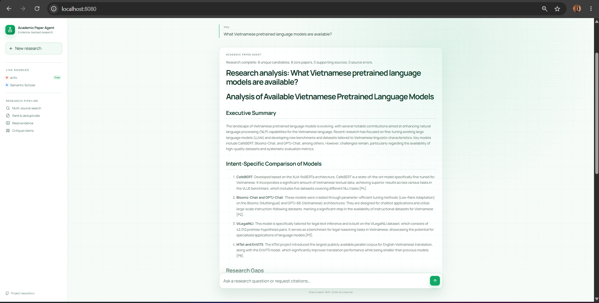
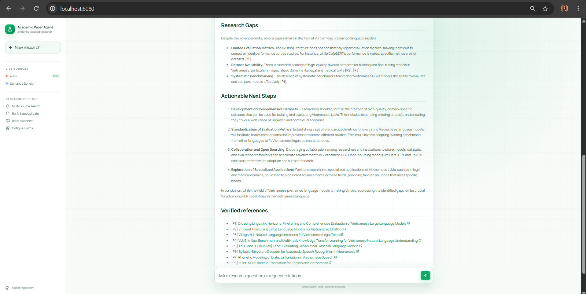
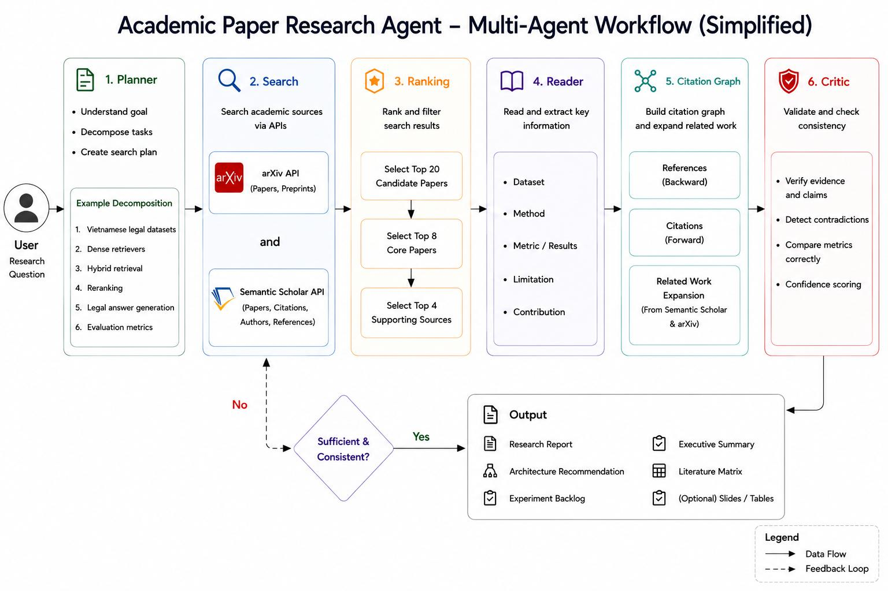

# Academic Paper Research Agent

<p align="center">
  
  
</p>

Ứng dụng hỗ trợ tìm kiếm và tổng hợp tài liệu học thuật từ arXiv và Semantic
Scholar. Hệ thống có FastAPI backend, giao diện React/Vite, chatbot terminal và
Docker Compose.

[Project report](https://github.com/trng28/Day04-Lab-Assignment-Prompt-Engineering-Tool-Calling-Labs/blob/main/starter_v0/artifacts/REPORT.md)

[Group eval evidence — v3](https://github.com/trng28/Day04-Lab-Assignment-Prompt-Engineering-Tool-Calling-Labs/blob/main/starter_v0/runs/v3_B_group_openai_20260729T163757156277.json)

[Xem video demo](https://drive.google.com/file/d/14EGcjM6-WPPux1PsS5l0WREn42VWzfuX/view?usp=sharing)

## Demo

Video trình diễn quá trình đặt câu hỏi, theo dõi trạng thái streaming và nhận báo
cáo nghiên cứu có nguồn tham khảo:

**[Academic Paper Research Agent Demo Here](https://drive.google.com/file/d/14EGcjM6-WPPux1PsS5l0WREn42VWzfuX/view?usp=sharing)**


## Workflow hiện tại



> Hình mô tả kiến trúc tổng thể. Citation Graph và vòng lặp phản hồi trong hình
> là hướng mở rộng, chưa được triển khai trong workflow hiện tại.

```text
Question
  -> Planner
  -> Search: arXiv + Semantic Scholar
  -> Anchor filter + lexical ranking + deduplication
  -> Chọn tối đa 20 candidates
  -> Gán tối đa 8 core + 4 supporting
  -> Reader: trích xuất dấu hiệu từ title/abstract
  -> Critic: cảnh báo so sánh metric khác ngữ cảnh
  -> Synthesizer
  -> Report + canonical references
```

### Các bước đã triển khai

1. **Planner** chọn một nhóm workstream theo câu hỏi:
   Vietnamese legal NLP, Vietnamese NLP tổng quát hoặc multimodal.
2. **Search** gọi arXiv theo từng workstream. Semantic Scholar chỉ được gọi một
   lần cho broad literature search và bị bỏ qua nếu không có API key.
3. **Ranking** lọc theo anchor của chủ đề, tính điểm lexical, gộp trùng theo
   `paper_id`, rồi sắp xếp theo điểm và ngày xuất bản.
4. **Reader** dùng regex trên title và abstract để nhận diện tên metric, dataset
   và dấu hiệu limitation. Bước này chưa đọc toàn văn bài báo.
5. **Critic** ngăn so sánh trực tiếp cùng một metric khi dataset hoặc bối cảnh
   đánh giá không xác định/khác nhau.
6. **Synthesizer** dùng LLM khi được cấu hình. Nếu LLM lỗi hoặc sinh citation
   không hợp lệ, hệ thống dùng báo cáo deterministic. Nếu không tìm thấy evidence,
   hệ thống trả về `Insufficient evidence`.

### Chưa triển khai

- Citation graph và tìm papers citing/cited-by.
- Web, GitHub và social search trong `ResearchWorkflow`.
- Dense retrieval, hybrid retrieval hoặc cross-encoder reranking.
- Full-text reading trong workflow chính.
- Token streaming trực tiếp từ LLM provider.

Các tool Web, social và PDF có tồn tại trong project lab nhưng chưa được nối vào
pipeline `ResearchWorkflow`.

## Nguồn dữ liệu

### arXiv

- Không cần API key.
- Dùng Atom API tại `export.arxiv.org`.
- Có rate limit trong process và cấu hình `ARXIV_USER_AGENT`.
- Được gọi theo từng workstream của Planner.

### Semantic Scholar

- Dùng Academic Graph Paper Search API.
- Chỉ hoạt động trong workflow khi có API key.
- Gửi key bằng header `x-api-key`.
- Nếu nguồn này lỗi hoặc bị HTTP 429, arXiv vẫn tiếp tục hoạt động.

Biến môi trường chuẩn:

```dotenv
SEMANTIC_SCHOLAR_API_KEY=your-key
```

`SEMANTIC_SCHOLAR_API` và `SEMATIC_SCHOLAR_API` vẫn được chấp nhận để tương thích
với cấu hình cũ.

## Ranking và relevance score

Code nằm trong `ResearchWorkflow.rank()` tại `research_workflow.py`.

`terms()` chuyển text về chữ thường, bỏ dấu tiếng Việt, tách token, bỏ stopword
và trả về một `set`. Vì vậy tần suất xuất hiện của token không ảnh hưởng điểm.

```python
query_terms = terms(f"{plan.question} {' '.join(plan.workstreams)}")
anchor_terms = terms(plan.search_topic)
document_terms = terms(f"{paper.title} {paper.abstract}")
```

Khi dùng adapter mặc định, paper phải khớp ít nhất một anchor nếu topic có tối đa
hai anchor; nếu topic dài hơn, paper phải khớp ít nhất hai anchor.

```python
coverage = len(query_terms & document_terms) / max(1, len(query_terms))
title_overlap = len(query_terms & terms(paper.title))
anchor_overlap = len(anchor_terms & document_terms)

relevance_score = round(
    coverage + title_overlap * 0.08 + anchor_overlap * 0.12,
    4,
)
```

Điểm không được chuẩn hóa về `[0, 1]`. Đây là lexical score, không phải cosine
similarity hay điểm từ reranker.

Paper được deduplicate theo `paper_id`; phiên bản có score cao hơn được giữ lại.
Kết quả được sắp xếp theo:

1. `relevance_score` giảm dần.
2. `published_at` giảm dần khi bằng điểm.

| Vị trí | Role |
|---:|---|
| 1–8 | Core |
| 9–12 | Supporting |
| 13–20 | Candidate |

## Synthesis và citation

LLM chỉ nhận tối đa 8 core và 4 supporting papers. Evidence gửi vào model gồm ID,
title, URL, authors, publication date, workstream, abstract và metadata được
Reader trích xuất.

Prompt yêu cầu:

- trả lời cùng ngôn ngữ với câu hỏi;
- chỉ dùng evidence được cung cấp;
- đánh citation theo `[P1]`, `[P2]`, ...;
- không tự tạo paper, dataset hoặc metric;
- không so sánh số liệu khi protocol không tương thích.

Workflow kiểm tra rằng output có ít nhất một citation ID hợp lệ và loại citation
ID không tồn tại. Đây là kiểm tra định dạng/tham chiếu, không phải xác minh toàn bộ
từng claim với full text. Cuối báo cáo luôn có `Verified references` được dựng
deterministically từ canonical URL của các paper đã chọn.

## Streaming

API:

```http
POST /api/chat/stream
Content-Type: application/json
```

Request:

```json
{
  "message": "Analyze Vietnamese multimodal datasets",
  "session_id": "optional-session-id"
}
```

Response dùng NDJSON:

```json
{"type":"session","session_id":"..."}
{"type":"status","content":"[Planner] ..."}
{"type":"status","content":"[Search] ..."}
{"type":"content","content":"# Research analysis..."}
{"type":"done"}
```

Status của các stage được gửi ngay khi workflow chạy. Sau khi Synthesizer hoàn
thành, report được chia thành các chunk text để frontend hiển thị dần; provider
hiện chưa stream token LLM trực tiếp.

## Chạy bằng Docker Compose

Từ thư mục `starter_v0`:

```powershell
Copy-Item .env.example .env
```

Điền API key của provider và model:

```dotenv
LLM_PROVIDER=openai
LLM_MODEL=gpt-4o-mini
OPENAI_API_KEY=your-key

# Optional
SEMANTIC_SCHOLAR_API_KEY=your-key
```

Build và chạy:

```powershell
.\scripts\run_web.ps1 -Build
```

- Frontend: <http://localhost:8080>
- API docs: <http://localhost:8000/docs>
- Health check: <http://localhost:8000/api/health>

Dừng service:

```powershell
.\scripts\stop_web.ps1
```

Hai named volumes `research_artifacts` và `arxiv_papers` không bị xóa bởi script
dừng service.

## Chạy local

Tạo môi trường và cài dependency:

```powershell
py -m venv .venv
.\.venv\Scripts\Activate.ps1
python -m pip install -r requirements.txt
```

Backend:

```powershell
python -m uvicorn api:app --reload
```

Frontend, trong terminal khác:

```powershell
cd frontend
npm install
npm run dev
```

Mở <http://localhost:5173>.

## Terminal chatbot

Interactive:

```powershell
.\scripts\run_research_chat.ps1
```

One-shot và lưu report:

```powershell
.\scripts\run_research_chat.ps1 `
  -Question "Vietnamese legal retrieval augmented generation" `
  -Output "artifacts\vietnamese-legal-rag.md"
```

Các lệnh sau dùng kết quả gần nhất trong session:

- `/sources`: danh sách core và supporting sources.
- `/critique`: warnings và comparison rules.
- `/report`: in lại report.
- `/save [path]`: lưu Markdown.
- `/json [path]`: lưu structured result.
- `/help`: hướng dẫn.

Một câu hỏi plain text mới sẽ chạy một research workflow mới. Câu hỏi ngắn yêu
cầu source/citation có thể trả lại sources của kết quả gần nhất thay vì search lại.

## Chạy workflow trực tiếp

```powershell
python research_workflow.py `
  "Vietnamese legal retrieval augmented generation" `
  --output "artifacts\research_report.md" `
  --json-output "artifacts\research_result.json"
```

## Test

```powershell
.\scripts\test_research_workflow.ps1
```

Nếu dependency đã được quản lý sẵn:

```powershell
.\scripts\test_research_workflow.ps1 -SkipInstall
```

Script chạy các test cho arXiv, Semantic Scholar, workflow, chatbot và streaming
API, sau đó kiểm tra syntax bằng `compileall`.

## Cấu trúc chính

```text
starter_v0/
|-- api.py                         FastAPI NDJSON streaming API
|-- research_chat.py               Session chatbot và command handling
|-- research_workflow.py           Planner/search/rank/read/critic/synthesis
|-- tools/
|   |-- papers/tool.py             arXiv adapter và Paper model
|   `-- semantic_scholar/tool.py   Semantic Scholar adapter
|-- frontend/                      React/Vite UI, Nginx production image
|-- tests/                         Workflow/API regression tests
|-- scripts/                       Run, stop và test scripts
|-- assets/lab-04-workflow.jpg     Architecture diagram
|-- Dockerfile.backend
`-- docker-compose.yml
```
